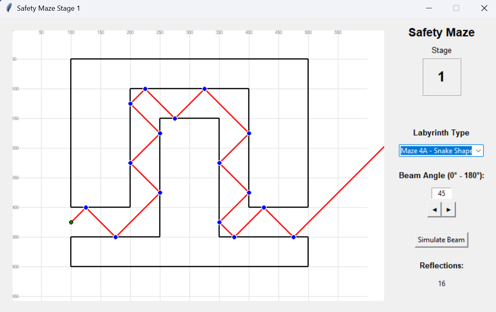

# 🔴 Safety Maze – Laser Reflection Simulator

**Safety Maze** is a visual simulation tool that traces laser beams through a 2D maze and shows how they reflect off surfaces.  
Designed for quick testing, learning, and debugging of beam paths using Python + Tkinter.

> ⚠️ **Disclaimer:** This is a solo laser simulation project built while I juggle Python, laser physics, and questionable design decisions.  
> It’s currently held together with duct tape, Tkinter, and hope.  
> Things are messy. That’s intentional (probably).  
> There’s a later stage where everything is supposed to look clean, modern, and professional ... assuming I ever get there.  
> Until then, welcome to the chaos. It works… mostly.

---

## ✅ Stage 1 – Core Simulation [Completed]

This stage focused on building the basic simulation loop and getting beam reflections working with visual output.

### ✔️ Features Implemented
- [x] Tkinter-based GUI layout
- [x] Prebuilt maze presets with selectable dropdown
- [x] Beam input system (0°–180°)
- [x] Surface-normal reflection logic for realistic beam bouncing
- [x] Nudge system to prevent beam getting stuck at walls
- [x] Logs each beam segment to `results/beam_log.csv`
- [x] CSV includes: start/hit points, angle_in, angle_out
- [x] GUI loads CSV and plots:
  - Red beam lines
  - Blue reflection dots
  - Green start point
- [x] Displays reflection count

📦 Finalized: **2025-07-02**  
📁 Output: `results/beam_log.csv`

## 🖼 Stage 1 Preview



---

## 🧪 Stage 2 – Geometry Expansion [Active]

This stage adds dynamic maze shaping and begins expanding simulation depth.

### 🔧 Planned Features
- [ ] Define maze wall dimensions (gaps, segment length)
- [ ] Support editable labyrinth presets
- [ ] Visualize dimensional changes in the GUI
- [ ] Load/save maze presets from file

---

## 🗺️ Project Roadmap

Here’s a flowchart of where this is heading.  
I'm building this solo, so technically I’m the captain here.  
Do I know what I’m doing? Sort of. It’s like setting sail for South America and probably ending up in Antarctica ... but with lasers.

Paste the following into [Mermaid Live Editor](https://mermaid.live/edit) to view:

<details>
<summary>📊 Click to view full roadmap</summary>

```mermaid
graph TD
    A[Stage 1: Core Simulation ✅] --> B[Stage 2: Geometry Expansion 🔧]
    B --> C[Stage 3: Material Presets + Basic Beam Decay 🔬]
    C --> D[Stage 4: Energy Mapping + Surface Interaction ⚡]
    D --> E[Stage 5: Gaussian Beam Modeling + Divergence 🔍]
    E --> F[Stage 6: Result Analytics + Graph Exports 📊]
    F --> G[Stage 7: UI/UX Redesign in Figma 🎨]
    G --> H[Stage 8: Frontend Rebuild (React or PyQt) 💻]
    H --> I[Stage 9: Backend Refactor (FastAPI or Flask) 🔗]
    I --> J[Stage 10: Final Tool Packaging + Sharable App 🚀]
```
</details>

---

## 📌 Upcoming Stages

### 🔬 Stage 3 – Material Presets + Basic Beam Decay

This stage introduces basic surface physics to the maze walls and simulates power loss for more realistic modeling.

#### 🎯 Goals
- Define preset surface types with rough reflectivity values  
  _(e.g. polished aluminum, anodized, matte plastic)_
- Introduce a basic energy decay model (e.g. linear % loss per bounce)
- Extend CSV log to track remaining power after each reflection
- (Optional) Add visual hint on beam strength via line opacity
- Prep groundwork for more advanced physics in Stage 4+

---

### ⚡ Stage 4 – Energy Mapping + Surface Interaction

Now that decay exists, it's time to **visualize** energy loss along the beam's path and **simulate interaction with different surface materials**.

#### 🎯 Goals
- Map total energy dissipation along the beam's travel path
- Use color gradients or line thickness to visualize intensity drop-off
- Factor in different absorption rates for surface types (e.g. matte absorbs more than polished)
- Optionally log absorption per surface type for post-sim analysis
- Display a basic total energy loss summary in the GUI

---

### 🔍 Stage 5 – Gaussian Beam Modeling + Divergence

The current simulation uses a single "pencil-thin" beam. This stage introduces realistic **Gaussian beam physics** with divergence and width.

#### 🎯 Goals
- Simulate a **beam with width**, not just a line
- Add Gaussian **intensity distribution** across beam cross-section
- Allow user to input:
  - Beam waist (w₀)
  - Divergence angle (θ)
- Implement multi-ray simulation or envelope visualization
- Handle **beam clipping** in narrow passages
- Prepare output data for energy-based hit maps

---

### 📊 Stage 6 – Result Analysis + Graph Exports

This stage focuses on turning simulation data into **useful feedback** and **engineering insights**. Users should be able to see what happened,and why.

#### 🎯 Goals
- Add a result summary pane or tab after each simulation
- Show graphs such as:
  - Power vs. number of bounces
  - Beam strength per segment
  - Energy absorbed per material
- Export simulation results to:
  - CSV / JSON (raw data)
  - PNG / SVG (beam path)
  - PDF (summary report)
- Optionally include annotations for critical loss points

---

### 🎨 Stage 7 – UI/UX Redesign in Figma

Before rebuilding the app visually, this stage focuses on designing a cleaner, more intuitive interface using modern UX best practices.

#### 🎯 Goals
- Build wireframes and screen flows in **Figma**
- Improve layout hierarchy (beam inputs, canvas, result panel)
- Consider dark mode and accessibility (color contrast, font size)
- Plan responsive layout for desktop + future tablet support
- Share mockups for community feedback
- Set visual spec to guide React/PyQt rebuild

---

### 💻 Stage 8 – Frontend Rebuild (React or PyQt)

This stage replaces the basic Tkinter interface with a modern, responsive UI built in a framework suitable for long-term use.

#### 🎯 Goals
- Choose between:
  - **React** (with Electron/Tauri for desktop app)
  - **PyQt** (native Python GUI)
- Rebuild canvas interactions (click, zoom, pan if needed)
- Load maze presets and input data through redesigned interface
- Show real-time results and reflection count updates
- Improve UI feedback (loading states, errors, input validation)

---

### 🔗 Stage 9 – Backend Refactor (FastAPI or Flask)

This stage separates the simulation logic from the interface, enabling better scalability, modularity, and potential web deployment.

#### 🎯 Goals
- Move core simulation logic into a **backend module**
- Expose RESTful endpoints for:
  - Running a simulation
  - Retrieving results
  - Exporting files
- Framework options:
  - **FastAPI** (preferred for speed and auto-docs)
  - **Flask** (simpler but less modern)
- Allow frontend (React/PyQt) to call backend via HTTP
- Structure code for potential cloud or local deployment

---

### 🚀 Stage 10 – Final Tool Packaging + Sharable App

The final stage is all about **polishing**, **packaging**, and making it easy for others to use, test, or contribute to the tool.

#### 🎯 Goals
- Bundle the app for cross-platform desktop use:
  - Use **PyInstaller**, **Electron**, or **Tauri** depending on the stack
- Add versioning and changelog
- Build clean `README.md` + `CONTRIBUTING.md` + license info
- Ensure all simulation files are portable + easily saved/shared
- Create example simulations + demo videos or GIFs
- Publish on GitHub Releases or a public landing page

---

## 📁 File Structure (Current)

```
/gui.py                → GUI logic & visualization
/stage_01_core.py      → Beam tracing logic + reflection system
/results/beam_log.csv  → Simulation output (auto-overwritten)
/maze_presets.py       → Predefined shapes for testing
```

---

## 🚀 Usage

```bash
pip install shapely
python main.py
```

1. Select a maze preset  
2. Enter a beam angle (0–180°)  
3. Click **Simulate Beam**  
4. View beam path, reflection count, and hit data

---

## 📣 Notes

This project is still a work in progress and designed to grow over time as I figure things out, both in terms of **beam physics** and **how to code without losing my mind**.

I’ve mapped out the stages, but hey, like any good experiment, things might shift as I learn more.

If you happen to stumble across this and have feedback, tips, or even a better way to do something I’m wrestling with, I’m all ears.  
I’m always happy to learn (and occasionally break things along the way). 😅

---

## 🔒 License

This project is licensed under the **Creative Commons Attribution-NonCommercial 4.0 International License**.

You may share, adapt, or build upon this project **non-commercially**, as long as you give proper credit.  
🔗 [View full license](https://creativecommons.org/licenses/by-nc/4.0/)

---
